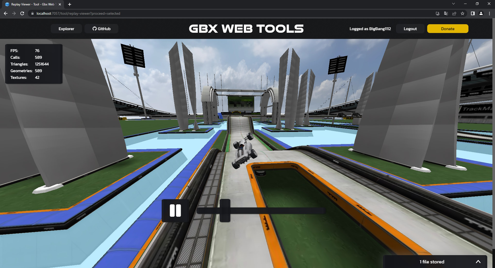

# Replay Viewer [(online)](https://gbx.bigbang1112.cz/tool/replay-viewer)

Hosted on [Gbx Web Tools](https://github.com/bigbang1112-cz/gbx), lives on [Gbx Tool API](https://github.com/bigbang1112-cz/gbx-tool-api), internally powered by [GBX.NET](https://github.com/BigBang1112/gbx-net).

Replay Viewer is an online tool that allows viewing replays inside your web browser (includes PC and phone).

It uses the [Map Viewer Engine](https://github.com/bigbang1112-cz/map-viewer-engine) tool and THREE.js under the hood.

